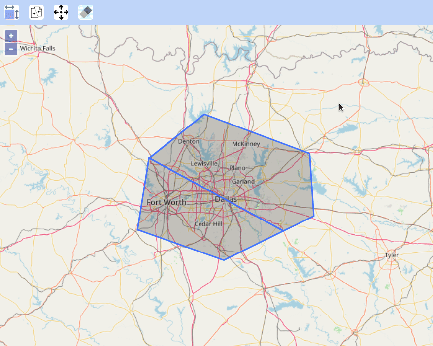

# OpenLayersPolygonsMerge
Merge two adjacent polygons in openlayers into one.

#For tutorial, click on following link 
[Merge two adjacent polygons in openlayers into one.](https://geoknight.medium.com/merge-two-polygons-in-openlayers-551467d9b016 "")
